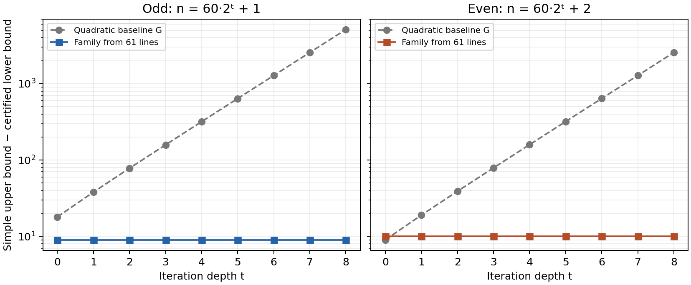

# Kobon research: OpenMath construction and upper-bound development

Research interval: 5 October 2026, 21:57:07 UTC to 6 October 2026, 04:57:07 UTC.
Author of this research programme: Alejandro Zarzuelo Urdiales.
This directory records the new research branch. Integration into the earlier
long and journal manuscripts is deferred at the author's request.

The project has **not** solved the unrestricted Kobon problem. The advances
below concern actual straight-line constructions, general geometric extension
rules, and quantified upper bounds for arrangement classes. A theorem with a
class hypothesis is not an unrestricted numerical bound for `K(n)`.

## 1. A compatible 61-line seed and an improved infinite even family

Let `q_t=60·2^t`. The new 29-visible-pair seed gives the targets

\[
K(q_t+1)\ge1200\,4^t-10,\qquad
K(q_t+2)\ge1200\,4^t+30\,2^t-11.
\]

The 61-line geometric seed and the infinite iteration theorem have passed
Lean: 1190 distinct empty triangles, 59 axis caps, 29 visible pairs, the
actual tangent-grid directions, simplicity, and an arbitrarily small
positive parameter. The unconditional endpoint is
[OpenMathConstructionParetoFamily61.even_classical](../../Kobon/OpenMathConstructionParetoFamily61.lean).
Its proof uses seven explicit finite native-evaluation certificate roots
and the standard logical axioms. The older 28-pair family remains
separately preserved.

The seed count 1190 is credited to **Rohith Poola's OpenMath submission**;
it is not a new finite triangle record. The compatible reciprocal-slope
refit, the true-tangent uniform certificate and the 29-pair improvement are
the developments in this run. Iteration uses the construction of Bartholdi,
Blanc and Loisel. An absolute first-in-literature claim for the numerical
orbit is not established by the bounded source review.

Relative to the previously verified quadratic baseline
`G(n)=floor(n(n−3)/3)+1+(n mod 2)` for `n≥3` in this repository
(the executable baseline is zero at `n<3`):

| Lines | Baseline G | New family bound | Improvement over G |
|---:|---:|---:|---:|
|61|1181|1190|9; the finite count was already in Poola's submission|
|62|1220|1219|0; retain 1220|
|121|4761|4790|29|
|122|4840|4849|9|
|241|19121|19190|69|
|242|19280|19309|29|
|481|76641|76790|149|
|482|76960|77029|69|

These comparisons do not assert that every earlier repository value was the
best value in all literature. Against its quadratic baseline
`G(n)=floor(n(n−3)/3)+1+(n mod2)`, the odd gain is `20·2^t−11` and
the even gain is `10·2^t−11`. At the displayed odd/even orders the new
arrangements remain respectively 9 and 10 triangles below the **simple
arrangement** upper bound. This is not a10-triangle gap theorem for the
unrestricted problem, which also permits multiple intersections.

The fixed seed's visible-count recurrence is `V_t=30·2^t−1`, not
`29·2^t`. This distinction accounts for the strongest even formula.

The horizontal family gaps are9 and 10. The quadratic baseline's gap grows
with `q_t`; at depth zero the baseline is stronger in the even case.
The plotted data are exact formula evaluations, not fitted search counts:
[data](figures/family61-formula-data.json),
[reproduction script](../../experiments/2026-10-05/plot_family61.py).

See [construction evidence and search methods](constructions/README.md),
[the preserved 28-pair and new 29-pair provenance](constructions/construction-proof-provenance.json),
and [source priority review](corpus/INFINITE_FAMILY_PRIORITY_CHECK.md).

### A sound portfolio for every natural order

[ConstructionEnvelope.all_n](../../Kobon/OpenMathConstructionEnvelope.lean)
proves an actual straight-line witness for every natural number at the
executable bound

\[
L(n)=\max\left(L_{\rm previous}(n),\max_{0\le t\le n}
 \{F_{33}(n,t),F_{37}(n,t),F_{49}(n,t),F_{61}(n,t)\}\right).
\]

Each candidate is zero away from its specified odd/even orders. The previous
envelope is retained pointwise. The result therefore cannot weaken that
established all-order bound. Strict gains in the displayed table are proved
against `G`, and the new even family improves the preceding 28-pair family
by one triangle at every depth. These comparisons do not prove strict
improvement over every candidate in the previous envelope or every bound
in the literature.

The completed compatible 37-line branch gives, for `q=36·2^t`,
`q+1` lines with `432·4^t−1` triangles and `q+2` lines with
`432·4^t−1+18·2^t` triangles. Both attain the appropriate **simple-model**
upper floors. The numerical family is already attributable to the
Parpalak–Utkin/Blanc line of constructions; the contribution here is its
compatible exact certificate and formal integration with the successor rule.
At 38 lines its 449 triangles are below the retained unrestricted witness
with 450 triangles. Proof:
[ConstructionFamily37](../../Kobon/OpenMathConstructionFamily37.lean).

## 2. An indefinite successor rule for both parities

For a supplied simple arrangement with `n≥3` and at least`T` triangles, set

\[
\delta=n(n-2)-3T,\quad
g(n,T)=\min\!\left(\lfloor n/2\rfloor,
 \left\lceil\frac{\max(3,\max(0,n-\delta))}{2}\right\rceil\right).
\]

There is a simple straight-line arrangement with `n+1` lines and at least
`T+g(n,T)` triangles. This rule can be iterated indefinitely, alternating
both parities. It is derived from actual outward terminal rays, the exact
sector-selection count and integer averaging, rather than a visibility
assumption. For`n≥4` every step gains at least two triangles. For odd`n`
with `δ≤2`, it gains`floor(n/2)`.

The formula is the exact arithmetic simplification of
`ceil((n−1)max(3,max(0,n−δ))/(2n))`. The result does **not** prove the
old half-order gain from every arbitrary seed, and general-position
simplicity is a real hypothesis. Its iterative formula can be weaker than
the established quadratic baseline; useful near-optimal seeds are needed
for numerical improvements.

Proofs: [ExtensionFormula](../../Kobon/OpenMathExtensionFormula.lean),
[EveryOrderExtension](../../Kobon/OpenMathEveryOrderExtension.lean),
[OptimalSuccessor](../../Kobon/OpenMathOptimalSuccessor.lean).
Detailed geometry and attribution are in
[BOUNDARY_RESEARCH_STATUS](BOUNDARY_RESEARCH_STATUS.md) and
[SUCCESSOR_ATTRIBUTION](corpus/SUCCESSOR_ATTRIBUTION.md).
The perfect-seed exterior step was already described by BBL2007, and
specific near-perfect examples appeared in Blanc2008. The general
deficit-dependent theorem and its fully extracted Lean proof are the
contribution developed here, subject to further priority review.

## 3. Degree-free structural upper bounds

The variables below are extracted from an actual finite injective triangle
certificate in an arrangement of pairwise nonparallel real lines:

* `T` is the certified triangle count and `δ=n(n−2)−3T`.
* A core is an intersection incident with `r≥3` lines.
* `a` is its number of shared edges ending at ordinary vertices;
  `d` is its number of shared edges ending at other cores.
* Components are the connected components of the actual shared-core graph.
  `c` counts them and `U` counts unused bounded arrangement segments.
* `A` counts triple cores with `(a,d)=(2, 4)`;
  `B_s` counts triple cores with `(a,d)=(1, 5)` in component`s`.
* `h=Σ_{r≥4}r(r−4)` is the higher-multiplicity surplus.

For **arbitrary multiplicities and arbitrary component degrees and sizes**:

\[
\boxed{\delta+A+\sum_s\lceil B_s/2\rceil\ge U+c+h.}
\]

A complementary doubled statement is
`2δ+2A+B≥2U+c+2h`. The proof uses actual fan extraction, injective
charging, connected-component partitions and finite geometric escape;
no planar-graph or convex-hull oracle is a premise of the final theorem.

In the all-triple class, marked ordinary ports pay the non-antipodal full
two-cap cores, giving the stronger correction `A_0` counting only the
unmarked`(2, 4)` cores:

\[
\boxed{\delta+A_0+\sum_s\lceil B_s/2\rceil\ge U+c.}
\]

This halves the earlier coefficient two on the residual two-cap
correction and pairs the one-cap corrections within each component.
It is a structural inequality; the remaining corrections cannot simply
be dropped when calculating a universal numerical upper bound.

A second, degree-free all-triple theorem improves the unmarked two-cap
coefficient further:

\[
\boxed{2\delta+A_0+B\ge 2U.}
\]

Here `B=Σ_s B_s`. Its proof combines actual antipodal cone incidence with
marked-port capacity. An actual one-cap core of shared-core degree three
cannot have three antipodal neighbours; this geometric exclusion is what
removes the exceptional term from the finite discharging calculation.
The theorem is fully checked with the standard logical axioms:
[HalfCurvature.certificate_half_defect_bound](../../Kobon/UpperOpenMathHalfCurvature.lean).
Neither this inequality nor the earlier component inequality dominates the
other for every distribution of correction types.

The completed component theorem retains both rules simultaneously:

In the remaining all-triple component formulas, `A_s` counts the unmarked
`(2,4)` cores of `A_0` in component `s`, and `B_s` counts its `(1,5)` cores.

\[
\boxed{\delta\ge U+\sum_s
\max\!\left(1-A_s-\lceil B_s/2\rceil,
 -\lfloor(A_s+B_s)/2\rfloor\right).}
\]

The maximum is taken **within each component**, which preserves useful
penalties when different components favour different charging rules.
Proof: [ClosedHalfCurvature](../../Kobon/UpperOpenMathClosedHalfCurvature.lean).

The first completed global half-coefficient gain theorem also retains the
positive local types. Let `E3` count three-cap triple cores, and `P21` count
partial two-cap cores with `(a,d)=(2, 1)`. Then

\[
\boxed{4\delta+2A_0+2B\ge4U+6E_3+5P_{21}.}
\]

This improves the preceding global half inequality whenever those positive
types occur. The coefficient calculation and actual geometric extraction
both use only the standard logical axioms. Proof:
[HalfCurvatureGain.certificate_half_gain_defect_bound](../../Kobon/UpperOpenMathHalfCurvatureGain.lean).

These positive terms have also been retained **component by component**.
The completed gain hybrid endpoint is

\[
\boxed{\delta\ge U+\sum_s\max\!\left(
 1-A_s-\lceil B_s/2\rceil,
 \left\lceil\frac{6E_s+5P_s-2A_s-2B_s}{4}\right\rceil\right).}
\]

Its dominance over the preceding component hybrid is itself proved in Lean.
Proof: [ClosedHalfCurvature.certificate_hybrid_gain_component_defect](../../Kobon/UpperOpenMathClosedHalfCurvature.lean).

A complementary general theorem makes the residual geometry more specific.
Let `J13` count `(a,d)=(1,3)` cores with exactly two antipodal neighbours.
The actual nonfull-recipient restriction gives

\[
\boxed{2\delta+B+J_{13}\ge2U+3E_3+2P_{21}.}
\]

There is no correction for the total number of antipodal sources in this
inequality. Only the specific double-recipient type remains. This does not
dominate the preceding half inequality for every distribution of types;
both are retained as intermediate results. The sharper exclusion described
below now removes `J13` completely. Proof of this intermediate result:
[DoubleRecipientCurvature.certificate_double_recipient_defect_bound](../../Kobon/UpperOpenMathDoubleRecipientCurvature.lean).

The double-recipient inequality is also proved on each closed component:
`2H_s+B_s+J_s≥3E_s+2P_s`. Taking the maximum of its rounded score
`ceil((3E_s+2P_s−B_s−J_s)/2)` and the preceding component gain score,
before summing, gives a further proved improvement. See
[ClosedDoubleRecipientCurvature](../../Kobon/UpperOpenMathClosedDoubleRecipientCurvature.lean).

An actual closed component containing **at most one antipodal source**,
with no restriction on its size, already satisfies
`2H_s+B_s≥3E_s+2P_s`. The source-intersection theorem proves this source
condition for every closed component of size at most seven. Therefore
an all-triple arrangement whose components all have at most seven cores
satisfies

\[
\boxed{\delta\ge U+\sum_s
 \left\lceil\frac{3E_s+2P_s-B_s}{2}\right\rceil.}
\]

The adaptive theorem applies this score wherever the actual source count
is at most one and otherwise retains the preceding gain score. Its
soundness and dominance are both checked. Proofs:
[SingleSourceCurvature](../../Kobon/UpperOpenMathSingleSourceCurvature.lean),
[SingleSourceComponents](../../Kobon/UpperOpenMathSingleSourceComponents.lean).
The `B_s` correction remains; this does not prove `δ≥U+c` for seven-core
components.

### Completed source-free strengthening

The full six-case geometric argument now proves that an actual one-cap,
three-core recipient has **at most one** antipodal source neighbour. The
argument uses selected empty triangle sides, exact support exhaustion,
outward antipodal continuations, and affine area signs. Its extraction from
actual line arrangements is complete. Hence `J13=0`, without any restriction
on component size or degree. A further actual partial-core lemma proves
that a `(2,1)` recipient has no antipodal source neighbour, increasing its
positive coefficient from two to three. The resulting global
endpoint is

\[
\boxed{2\delta+B\ge2U+3(E_3+P_{21}).}
\]

Equivalently, for the certified family of `T` triangles,
`6T≤2n(n−2)+B−2U−3(E3+P21)`. All counts are extracted from the actual
arrangement. This is a general structural upper bound in the all-triple
class; it is not yet an improved unrestricted numerical formula for `K(n)`.
The `B` correction remains, and higher multiplicities need separate resources.

The corresponding component endpoint is

\[
\boxed{\delta\ge U+\sum_s\max\!\left(
1-A_s-\lceil B_s/2\rceil,
\left\lceil\frac{3E_s+3P_s-B_s}{2}\right\rceil\right).}
\]

Its score simplifies to the displayed maximum and dominates the earlier
half-gain portfolio in Lean. Structural and geometric proofs use only the
standard logical axioms. Principal proof roots:
[N13NoDouble](../../Kobon/UpperOpenMathN13NoDouble.lean),
[N13ActualNoDouble](../../Kobon/UpperOpenMathN13ActualNoDouble.lean),
[PartialRecipients](../../Kobon/UpperOpenMathPartialRecipients.lean),
[N13Curvature](../../Kobon/UpperOpenMathN13Curvature.lean).

The final strengthening also proves that an actual `(a,d)=(1,2)` core has
at most one antipodal source neighbour. Write `N12` for the total number
of these cores. The completed N12 global estimate is

\[
\boxed{2\delta+B\ge2U+3(E_3+P_{21})+N_{12}.}
\]

Thus `6T≤2n(n−2)+B−2U−3(E3+P21)−N12`. The component estimate is

\[
\boxed{\delta\ge U+\sum_s\max\!\left(
1-A_s-\lceil B_s/2\rceil,
\left\lceil\frac{3E_s+3P_s+N_{12,s}-B_s}{2}\right\rceil\right).}
\]

Both the geometric recipient restriction and the summed bound are proved
for actual arrangements, with only the all-triple class hypothesis. Lean
also proves that this score dominates the preceding source-free score.
Proofs: [N12Recipient](../../Kobon/UpperOpenMathN12Recipient.lean),
[N12Curvature](../../Kobon/UpperOpenMathN12Curvature.lean),
[ClosedN12Curvature](../../Kobon/UpperOpenMathClosedN12Curvature.lean).

In particular, if **every component** satisfies
`B_s+1≤3E_s+3P_s+N12_s`, then `δ≥U+c`, without a size or degree
restriction. This sufficient profile condition is explicit; it has not
been proved for every arrangement. Its extraction and integer rounding
are checked in
[PositiveProfileComponents](../../Kobon/UpperOpenMathPositiveProfileComponents.lean).

The final local marked/antipodal edge-disjointness theorem also retains a
positive unit at every marked balanced core. Let `M22` count cores with
`(a,d)=(2,2)` and `m≥1`. The strongest completed global estimate is

\[
\boxed{2\delta+B\ge2U+3(E_3+P_{21})+N_{12}+M_{22}.}
\]

Equivalently, `6T≤2n(n−2)+B−2U−3(E3+P21)−N12−M22`.
The extra unit comes from the local budget `m+x≤d`: at a marked balanced
core, the discharging gap is `2m−x≥1`. Both the local incident-edge
competition and the actual global wrapper use only the standard logical
axioms. Proofs: [LocalPortBudget](../../Kobon/UpperOpenMathLocalPortBudget.lean),
[M22GainWeights](../../Kobon/UpperOpenMathM22GainWeights.lean),
[M22Curvature](../../Kobon/UpperOpenMathM22Curvature.lean).
The component portfolio displayed above is retained separately; this final
`M22` strengthening is currently a global theorem.

| Arrangement class | Verified penalty bound |
|---|---|
|Any multiplicity, shared-core degree at most 3|`δ≥U+c+h`|
|Any multiplicity, shared-core degree at most 4|`δ+A≥U+c+h`|
|Any multiplicity, no degree restriction|`δ+A+Σ_s ceil(B_s/2)≥U+c+h`|
|Only triple cores, no degree restriction|`δ+A_0+Σ_s ceil(B_s/2)≥U+c`|
|Only triple cores, no degree restriction|`2δ+A_0+B≥2U`|
|Only triple cores, retaining positive local types|`4δ+2A_0+2B≥4U+6E3+5P21`|
|Only triple cores, no degree or component-size restriction|`2δ+B≥2U+3(E3+P21)`|
|Only triple cores, no degree or component-size restriction|`2δ+B≥2U+3(E3+P21)+N12`|
|Only triple cores, also retaining marked balanced cores|`2δ+B≥2U+3(E3+P21)+N12+M22`|
|Only triple cores, every component satisfies the displayed positive profile|`δ≥U+c`|
|Only triple cores, every component has at most 7 vertices|`δ≥U+Σ_s ceil((3E_s+2P_s−B_s)/2)`|
|Only triple cores, every component has at most 5 vertices|`δ≥U+c`|
|Any multiplicity, every component has at most 5 vertices|`δ≥U+c+h`|

The last row is proved in
[MixedFiveCoreComponents](../../Kobon/UpperOpenMathMixedFiveCoreComponents.lean).
It permits any total number of cores and components. Only each connected
component's order is restricted; the special case of at most five cores
in the entire arrangement follows immediately.

Principal endpoints:
[MixedCurvatureBound](../../Kobon/UpperOpenMathMixedCurvatureBound.lean),
[PaidCurvatureBound](../../Kobon/UpperOpenMathPaidCurvatureBound.lean),
[MixedDegreeFour](../../Kobon/UpperOpenMathMixedDegreeFour.lean),
[MixedDegreeThree](../../Kobon/UpperOpenMathMixedDegreeThree.lean),
[FiveCoreComponents](../../Kobon/UpperOpenMathFiveCoreComponents.lean).
Further component hull, forest, exposed-core and higher-multiplicity
inequalities are described in [upper/VERIFIED_PROGRESS](upper/VERIFIED_PROGRESS.md).
The exact discharging mechanism and remaining geometric obligations are in
[upper/CHARGING_FRONTIER](upper/CHARGING_FRONTIER.md).

The broad conclusion that exact Tamura equality forces a simple
configuration was already stated by Clément–Bader. Our sufficient-scope
equality corollaries do not claim first discovery of that conclusion.
The quantified component penalties and their completed geometric proofs
are the statements requiring a separate priority comparison.

## 4. Geometric obstructions that constrain the remaining corrections

An actual `(a,d)=(1,3)` core with an antipodal source neighbour cannot
maximize any affine functional injective on a finite closed shared-core
set containing it. This excludes that recipient type from an exposed
position without a diagram premise. It is a completed boundary lemma,
not yet a proof of strict positivity for every component. Proof:
[N13ActualSupportExtreme](../../Kobon/UpperOpenMathN13ActualSupportExtreme.lean);
[proof provenance](constructions/n13-support-extreme-proof-provenance.json).

A further actual local resource inequality gives
`m(p)+degreeFrom(A_0,p)≤d(p)` for every core in the all-triple class.
Marked edges terminate at poor cores, while antipodal-source edges
terminate at ordinary-degree-two cores. The incident-edge inventories are
therefore disjoint. This excludes a marked `(2,2)` receiver with two
antipodal neighbours. Proof:
[LocalPortBudget](../../Kobon/UpperOpenMathLocalPortBudget.lean).

In actual all-triple arrangements an unmarked full`(2, 4)` core cannot
share a core edge with another such core, or with an unmarked`(2, 2)` core.
These statements derive charts and occurrence matching from the actual
certificate. They do not assume a drawing of an abstract graph.

Proofs: [AntipodalAdjacency](../../Kobon/UpperOpenMathAntipodalAdjacency.lean),
[AntipodalBalancedAdjacency](../../Kobon/UpperOpenMathAntipodalBalancedAdjacency.lean).
The first also gives the aggregate incidence bound `4|A_0|≤D2`.

Further exact geometric inputs are now proved. Every antipodal full core
has at least two neighbours that are nonfull triple cores or higher cores;
in the all-triple class this gives
`2|A_0|≤E(A_0,nonfull)`. A one-cap triple core with `d=3` has at most
two antipodal neighbours. Two antipodal cores cannot have identical sets
of four actual core neighbours, because strict antipodal pairings uniquely
determine their common centre. Proofs:
[AntipodalConeIncidence](../../Kobon/UpperOpenMathAntipodalConeIncidence.lean),
[OneCapThreeCoreDegree](../../Kobon/UpperOpenMathOneCapThreeCoreDegree.lean),
[AntipodalSameNeighbors](../../Kobon/UpperOpenMathAntipodalSameNeighbors.lean).

The broader recipient restriction also holds: in the
all-triple class, **every nonfull recipient with `a+d≤4` has at most two
antipodal neighbours**, including the important `(0,4)` type. It follows
from actual ray-to-edge counting and the adjacent-cap obstruction.
Proof: [NonfullAntipodalRecipients](../../Kobon/UpperOpenMathNonfullAntipodalRecipients.lean).

The stronger intersection theorem is also completed: **two distinct
antipodal full triple cores share at most two actual core neighbours**.
Only the two source cores need have multiplicity three; their neighbours
may have arbitrary multiplicity. Opposite-pair extraction reduces the
configuration to either an intervening-vertex obstruction or two strict
cevians that would cross inside elementary arrangement segments.
Proof: [AntipodalThreeNeighbors.certificate_common_neighbor_card_le_two](../../Kobon/UpperOpenMathAntipodalThreeNeighbors.lean).
In particular a closed component of order at most seven cannot contain
two such sources: their two four-element neighbour sets would have at least
three common elements among the at most five remaining vertices.

A seven-vertex finite charging example meets equality in the half-coefficient
relaxation and defeats a smaller coefficient using only those numerical
hypotheses. It is **not** an arrangement: the two antipodal sources would
have the same four neighbours, which the preceding geometric theorem
forbids. Thus it identifies missing geometry in the finite relaxation,
not a sharpness theorem for Kobon arrangements. The exact example is
kernel-checked in
[HalfChargingObstruction](../../Kobon/UpperOpenMathHalfChargingObstruction.lean).

The residual negative types are **not** mutually independent. Exact
rational witnesses show an unmarked`(2, 4)` core adjacent to a marked
`(2, 4)` core at 8 lines/12 triangles, and adjacent to a full`(1, 5)`
core at 9 lines/16 triangles. Both are retained in the corpus.

The elementary-segment blockers and normalized full-star degree rules
are reusable geometric inputs, including
[CommonNeighbor](../../Kobon/UpperOpenMathCommonNeighbor.lean) and
[NonAntipodalStarDegree](../../Kobon/UpperOpenMathNonAntipodalStarDegree.lean).

## 5. Exact local surgery instead of an invalid loss rule

For parallel translation of one line in an arbitrary finite nonparallel
arrangement, every relevant determinant-side test is affine in the
translation parameter. A simultaneous positive threshold exists at which
all triangle predicates are classified exactly by constant and linear
coefficients. Consequently

`T(ε)+lost=T(0)+born`.

If the original arrangement has exactly one concurrent supporting triple,
then`born=1`; the loss set remains the exact global germ loss set.
Suitable corner-incidence conditions prove no loss and hence a genuine
one-triangle improvement. The theorem does not replace the loss set by
the number of old triangles in a half-plane.

Two complete real-parameter witnesses illustrate why that replacement
fails: a four-line arrangement keeps exactly two triangles after an
arbitrarily small resolution even though the proposed half-plane loss is
zero; a six-line arrangement has six triangles before resolution and
respectively seven or four under the two translation signs. Its reverse
wall crossing can gain two triangles. The downward direction loses three
old triangles, refuting a general cap of two on the loss count.

Proofs: [TranslationGerms](../../Kobon/OpenMathTranslationGerms.lean),
[TranslationCounting](../../Kobon/OpenMathTranslationCounting.lean),
[TranslationRetention](../../Kobon/OpenMathTranslationRetention.lean),
[TripleBirth](../../Kobon/OpenMathTripleBirth.lean),
[IsolatedTripleResolution](../../Kobon/OpenMathIsolatedTripleResolution.lean),
[FourLineResolution](../../Kobon/OpenMathFourLineResolution.lean),
[SixLineResolution](../../Kobon/OpenMathSixLineResolution.lean).
See [DESINGULARIZATION_AUDIT](corpus/DESINGULARIZATION_AUDIT.md) for the
precise source claim, hypotheses and counterexample scope.

## 6. Search coverage, stopped routes and next research

The useful combination of methods in this run is concrete. Linear-programming
cap cones propose deformations that preserve all axis caps; exact interval
arithmetic then certifies the actual tangent-grid geometry before Lean
iteration. Finite discharging identifies the expensive local types, while
straight-line fan and elementary-segment geometry excludes some of its
abstract equality configurations. Connected-component decomposition retains
the strongest applicable penalty locally. Affine determinant germs give an
exact wall-crossing description for surgery and expose its global losses.
These methods supply different proof obligations; a numerical optimum in
one relaxation is not substituted for geometric realizability.

The search scripts are retained under [experiments/2026-10-05](../../experiments/2026-10-05/).
The exact coordinate evidence, source hashes and bounded negative results
are in [corpus/TECHNIQUES_AND_OBSTRUCTIONS](corpus/TECHNIQUES_AND_OBSTRUCTIONS.md),
[seed_search/STRUCTURAL_PROBES](seed_search/STRUCTURAL_PROBES.md), and
[constructions/README](constructions/README.md).

Stopped routes include phase-zero families whose bounded faces are already
all triangular, deleting the cheapest line in the 61 orbit (four below the
quadratic baseline), and fixed-backbone even corridor lifts that lose too
many old triangles. A failed bounded search is never reported as an
impossibility theorem. The nonlocal cap-cone chamber searches preserve
all axis caps while crossing many concurrence facets; their 29-pair seed
improvement has been promoted only after exact uniform checks and Lean.

Highest-value remaining directions:

1. Prove strict positivity for the component profiles that the new maximum
   does not yet cover. The total antipodal correction has disappeared from
   the global estimate, but its role in strict component escape and the
   full `(1,5)` correction still require actual geometry. Independence
   shortcuts are explicitly disproved.
2. Establish a correct global ordinary-end token trade-off in the
   all-triple class. The candidate`C≥2D1` and the corrected token shortfall
   at most two remain unproved. The latter already fails for mixed
   multiplicities without extra correction.
3. Raise the compatible 61 seed above 1190 or its visibility above 29,
   or find other uniform compatible near-perfect seeds. The present
   observed maxima are not proved ceilings.
4. Obtain an actual recursive even corridor family; known small even
   examples do not by themselves prove that recurrence.
5. Use the exact germ classifier for surgery with global retention
   certificates, instead of an unsupported half-plane loss argument.

The final equality analysis narrows the strict-component route to two
matched boundary contacts, exposed unmarked `(2,2)` to `(1,3)` or `(0,4)`
recipients. It derives the necessary saturation steps before using the
existing marked-port coverage theorem. That equality decomposition is
recorded as mathematical analysis, not a separately formalized theorem:
[remaining zero-component analysis](constructions/remaining-zero-component-analysis.md).

## Verification and reproducibility

Structural and analytic theorems use only `propext`, `Classical.choice`
and `Quot.sound`. Finite computational certificate checks use explicit
`native_decide` roots; their additional trust in Lean native evaluation
is reported separately by the whole-project axiom audit.

The pinned toolchain is Lean 4.31.0. The final source hash manifest,
compiler logs and root audit are stored under [verification](../../verification/).
The frozen snapshot passed coverage for **638 active modules**: 265 were
compiled during this research run and 373 unchanged source/import closures
reuse the verified baseline. The fresh whole-project audit checked **9058
theorem declarations**: 8046 depend only on the standard logical axioms,
and 1012 additionally depend on explicit finite native-evaluation roots.
It found no admitted proofs or unapproved axioms. These counts describe
the entire retained project, not 9058 newly discovered results.
See [release verification](RELEASE_VERIFICATION.json) and
[whole-project summary](../../verification/lean-summary.json).

Verified proof claims refer to the active modules under `Kobon/`. Scratch
sources, unsuccessful compiler logs and bounded searches are retained as
research history; they are not substituted for a passing active theorem.
The incremental verifier reuses only unchanged source/import closures
from the completely verified baseline commit
`112409e2c62b78ecff7adcad49f1e014ea5f0773`, recompiles the new and
changed modules, and reruns the complete axiom audit. This is explicitly
distinguished from a clean rebuild of the old baseline. The usual
`scripts/verify_lean.py` remains the clean Lake-build CI verifier.
