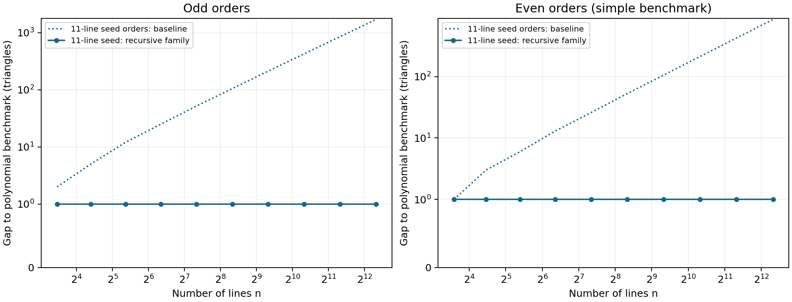

# Three-hour Kobon research review — 2 October 2026

Author and repository owner: **Alejandro Zarzuelo Urdiales**.
Authorized research window: 16:49:48–19:49:48 UTC. Starting revision:
`8d9f20a6c8afcc0312c5f28f81050cb8fa2595c0`.

This report distinguishes a new formal proof from a new numerical record.
The main completed advance is the actual geometric iteration of the hybrid
construction, including its stronger adjacent-even family. The unrestricted
Kobon problem and the proposed successor rule for arbitrary starting
arrangements are not solved.

The [proof index](PROOF_INDEX.md) maps the results to their declarations and
trust dependencies. The [release verification record](RELEASE_VERIFICATION.md)
records the final build, exact certificate checks, and uncompleted branches.

## 1. The infinite family is now geometric, not just arithmetic

For every integer `t >= 0`, put `q = 10*2^t`. There are simple real straight-line
arrangements satisfying

\[
K(q+1)\ge \frac{q^2-4}{3},\qquad
K(q+2)\ge \frac{q^2-4}{3}+\frac q2.
\]

Both displayed quotients are integers. The exact Lean declarations are
`BBLVerifiedFamilies.eleven_odd_family` and
`BBLVerifiedFamilies.eleven_even_family` in
[BBLVerifiedFamilies.lean](../../Kobon/BBLVerifiedFamilies.lean).
Their conclusions are `SimpleLowerBound`, whose witnesses are actual real
line coordinates and duplicate-free lists of empty nondegenerate triangles.
The existing cell theorem identifies those triangles with pairwise disjoint
arrangement cells.

The previous release proved one geometric BBL step and checked several finite
outputs. It did not retain enough of the output's geometry to iterate the
theorem. The new proof retains the sorted tangent grid, the saturated
distinguished line, a positive central apex, and the triangle list. For the
even bound it also retains an admissible direction, a visible-pair list, and
the rightmost boundary data. Arbitrary label permutations are handled by
proved transport lemmas. The next step establishes these properties again
for its own output, so induction is legitimate.

The internal recurrence, starting with `4r+1` lines, is

\[
r_{t+1}=2r_t,\quad T_{t+1}=T_t+(4r_t)^2,
\quad V_{t+1}=V_t+2r_t.
\]

The 21-line seed has `(r,T,V)=(5,132,10)`. Its original 11/12-line predecessor
supplies the `t=0` cases of the displayed family. Thus the extra triangle in
the stronger even formula is now justified at **every depth**, rather than
inferred from the saved finite checkpoints.

There is an important quantifier boundary: for every finite depth, the proof
chooses a sufficiently small positive parameter interval. It does not assert
that one fixed positive parameter works for all depths, nor that an arbitrary
optimal 49-line witness has this recursive shape.

Generic geometry and induction use only Lean's standard logical axioms.
The concrete odd family inherits four existing native certificate checks;
the even family inherits six. There are no added geometric axioms or proof
placeholders. Native checks additionally trust Lean's compiler/runtime.
See the [dependency and quantifier audit](bbl/RECURSIVE_PROOF_AUDIT.md).

### The 49-line compatibility certificate

A separate search found a well-conditioned, sorted 49-line seed with 767
triangles and all 47 distinguished-line caps. Its 48 reciprocal slopes are
fixed rational numbers; the intercepts are the actual values
`-tan(23*pi/48), ..., -tan(pi/48), -epsilon, epsilon, tan(pi/48), ...,
tan(23*pi/48)`. Exact rational interval checking proves preservation of the
required signs for every `0 < epsilon <= 1/100`. The central apex is positive.
A fixed exterior direction `(1,-2)` has 24 visible pairs throughout that
interval and satisfies the rightmost-boundary condition.

The [uniform certificate](constructions/uniform-grid49/uniform-seed.json)
and [visibility certificate](constructions/uniform-grid49/visibility.json)
record the data, input hashes, exact intervals, and checks. Two independent
cell counters also confirm 767 triangles at the rational midpoint witness.
`BBLTangent48Bounds` proves the actual tangent enclosures in Lean, using
half-angle and reciprocal identities starting from `tan(pi/3)=sqrt(3)`.
The full concrete seed check did not finish before the release freeze. It was
stopped and the five dependent sources preserved as [unverified drafts](drafts/README.md).
They are excluded from the active Lean library and its completed result claims.
The exact external certificate and isolated Lean tangent, graph, and arithmetic
checks remain available; see the [verification boundary](bbl/SEED49_STATUS.md).

If the uniform seed is linked to the general recursion, its formulas are
`q=48*2^t`, `T_odd=768*4^t-1`, and
`T_even=768*4^t+24*2^t-1`, at orders `q+1` and `q+2` respectively.
The odd family is exactly the tail `s=t+3` of
[Bartholdi–Blanc–Loisel, Theorem 1.3](https://arxiv.org/html/0706.0723v1),
which establishes the simple optimum for `n=6*2^s+1`. These numerical values
are not new records. The contribution of this branch is the explicit uniform compatibility
certificate and its proposed formal linkage. A positive floating grid fit
alone would not have sufficed: earlier fits moved triangles across infinity,
so the successful search additionally preserved the original affine signs.

## 2. The resulting bound for every natural number

Retain the previous release's bound `B(n)=Universal.bound n`, including all
138 finite coordinate certificates and the proved baseline

\[
G(n)=\left\lfloor\frac{n(n-3)}3\right\rfloor+1+(n\bmod2)
\quad(n\ge4).
\]

Let `L(n)` equal the appropriate constructed count above when
`n=10*2^t+1` or `n=10*2^t+2`, and zero otherwise. Then

\[
H(n)=\max\{B(n),L(n)\}
\]

is an unconditional lower bound at every natural order. The executable finite
maximum in [RecursiveEnvelope.lean](../../Kobon/RecursiveEnvelope.lean)
implements this envelope. It retains the stronger finite seeds where the
recursive construction is weaker, notably the perfect 21- and 41-line
certificates.

At family orders, the exact gains over `G` are

\[
L(q+1)-G(q+1)=\lfloor q/3\rfloor-2,
\qquad
L(q+2)-G(q+2)=q/2-\lfloor q/3\rfloor-2.
\]

Above order 195, the old repository envelope equals `G`. Therefore these are
strict improvements to the **previous verified repository bound** at
infinitely many orders, including every odd/even pair from 321/322 onward.
`BBLFamilyBenchmarks.strict_previous_tail` proves that statement for every
remaining depth. This is not a claim that the resulting numerical counts
exceed every previously published construction.

The family remains exactly one below the odd simple-arrangement upper bound
`floor(n(n-2)/3)` and the even simple-arrangement benchmark
`floor(n(2n-5)/6)`. Both upper bounds are now derived from actual simple
arrangements in `UpperSimpleOptimality` and `UpperEvenSimpleOptimality`.
`BBLFamilyOptimality` combines existence with these upper theorems: at each
family order, the simple optimum lies between our constructed count and that
count plus one. This does not supply an unrestricted upper theorem allowing
multiple concurrence. The [comparison table](family-comparison.csv) gives values, retained
maxima, and precise gains over the old release.

The figure plots formulas already proved in Lean. The vertical quantity is a
polynomial comparison, not a claim of an unrestricted new upper bound.

## 3. Upper-bound formalization and new local structure

The work proceeds from real lines and triangle interiors, rather than
assuming that arbitrary combinatorial fans are realizable.

- `UpperFan`: equality in `d1 <= 2r-3` forces a full fan with exactly three
  core-ended shared rays. Consequently `d2 <= 2` gives `d1 <= 2r-4`, extending
  the earlier `d2 <= 1` criterion.
- `UpperFanSupport` and `UpperCoreBoundary`: an extremal full fan cannot sit
  at an exposed core point, once its shared endpoints have been identified
  with the global core. The proof uses affine support and a determinant
  minimum principle, with its orientation and extraction hypotheses explicit.
- `UpperTripleFan`: two extremal triple fans cannot share the same matched
  elementary side with its two adjacent triangular cells. This is a new
  structural restriction on the exceptional triple-core graph. No global
  graph bound is inferred without the required extraction.
- `UpperElementaryEdges`: a certified triangle side has no intermediate
  arrangement vertex.
- `UpperEdgeCapacity`: at most two pairwise-disjoint triangular interiors can
  share one geometric side.
- `UpperTriangleIncidence`: actual unordered endpoint pairs and geometric
  capacity give the exact used/shared-side incidence identity. A certificate
  corollary obtains disjointness from the existing cell theorem.
- `UpperSharedIncidence` and `UpperVertexBudget`: shared-side endpoint
  classification, the core partition, and actual intersection multiplicity
  counts replace further previously assumed counting interfaces.
- `UpperEdgeInventory.certificate_defect_identity`: actual consecutive
  elementary segments and their cardinality now give
  `delta = S + U - D1 - D2` for pairwise nonparallel real arrangements and
  finite injective families of certified triangles. Incidence, capacity,
  and edge-cardinality identities are proved inside this theorem, not supplied
  as assumptions.

The aggregate arithmetic in `UpperCoreBudget` remains explicit about the
global premises it uses. In particular, the extended small-core estimate is
not an unrestricted upper bound for `K(n)`. The detailed current interface
and proof status are recorded in [the upper-bound progress note](upper/LOCAL_FAN_PROGRESS.md).

The extraction also proves `D2+h <= I`, `D2 <= choose(q,2)`, and the actual
multiplicity surplus `2S-7I+15q >= 0`. Here `q` is the number of core points,
`I` their line-incidence count, and `h` the number of lines meeting the core.
For at most three core points, `D2 <= 3` follows. These statements discharge
concrete geometric premises of the conditional budget. The clean-line premise
is now discharged below; global cyclic-fan extraction remains open. An independent review found no
missing geometric assumption in the extracted defect identity; its
[scope audit](bbl/INDEPENDENT_SCOPE_AUDIT.md) records the exact limitations.

`UpperSimpleOptimality.simple_lower_bound_upper` additionally derives
`3*T <= n*(n-2)` from any `SimpleLowerBound n T` with `n>=2`, extracting an
injective finite family directly from its duplicate-free list. This completes
the classical simple segment-count upper bound within the library, using
only standard logical axioms. The `UpperClean*` modules formalize the
common-half-plane, bounded-edge and local-pairing ingredients of a shorter
charging argument. `UpperCleanCover` extracts the actual disjoint base-pair
cover and local unused-or-shared charge; `UpperCleanCharging` then proves
`n-h <= 2U+D1` from the real arrangement and its triangle certificates.
No pairing, charge-existence or fiber-count premise remains in that theorem.
For simple arrangements the core is empty. `UpperEvenSimpleOptimality` uses
this charging theorem to prove `6*T <= n*(2*n-5)` for even `n>=4`, with only
standard logical axioms. Together the two upper theorems give the actual
one-triangle windows in `BBLFamilyOptimality`.
The geometric proof and current scope are recorded in
[CLEAN_LINE_MATCHING.md](upper/CLEAN_LINE_MATCHING.md).

## 4. Construction searches and exact obstructions

The session tried exact deletions, singular insertion neighborhoods,
pseudoline straightening, and strict linear fitting of perfect seeds to the
tangent grid. None of the searches completed so far produced a new numerical
lower-bound record. Negative searches retain their finite search scope.

The most useful new direction combines oriented-matroid sign data, linear
programming duality, and exact algebraic number arithmetic. In reciprocal
coordinates `x-v_i*y=a_i`, each required determinant sign is a strict linear
inequality in the reciprocal slopes. A positive linear dependence between
the rows excludes a realization, without any bound on those slopes.

The coefficient field is generated by `t=tan(pi/20)`, satisfying

\[
t^4-4t^3-14t^2-4t+1=0,\qquad 3/20<t<17/100.
\]

`BBLTangentAlgebra` proves the identity and identifies its real root;
`BBLTangentValues` proves the exact power-basis expressions for all nine grid
tangents. `StrictLinearCertificate` proves the classical positive-dependence
soundness principle. `BBLGridObstruction.actual_grid_orientation_impossible`
then rules out ten explicit determinant signs from a particular representative
on the actual tangent grid, for **every real epsilon and arbitrary reciprocal
slopes**. This representative result is a complete Lean proof with only
standard axioms.

A separate independent exact verifier first checked 366 polynomial
certificates for the 18 supplied projective representatives, with interval
`0 < epsilon < 1/25000`. A source review caught that these representatives
did not exhaust the affine cases: the projective classification includes
an infinity support. The corrected expansion uses all 236 supplied Euclidean
classes. The final standard-library checker validates 3,765 exact polynomial
dependencies and 15,060 reflected/reoriented variants, covering all
`236*21=4,956` class/distinguished-support cases, with no missing case, for
`0 < epsilon < 1/2000000`.

Consequently the supplied complete affine classification cannot provide a
perfect 21-line seed on this particular saturated tangent grid in that
interval, even with arbitrary parameter-dependent reciprocal slopes.
Completeness of the classification is external input attributed to
Parpalak–Utkin; the full dataset/certificate audit is exact computer-assisted
mathematics, not a complete Lean enumeration theorem. The separately proved
representative obstruction is the part fully inside Lean. Other grids,
larger seeds, and the unrestricted Kobon problem are not excluded.
The [construction report](constructions/README.md) records the final coverage,
verification commands, and remaining limitations.

## 5. Relation to previous research and earlier repository work

The BBL doubling gain retains its attribution to Bartholdi, Blanc and Loisel.
The classical power-of-two family, including the 33-line seed branch, retains
its attribution to Forge and Ramírez Alfonsín. The 49-line branch is a tail of
BBL's `n=6*2^s+1` family in Theorem 1.3. This session's principal contribution is completing the
geometric recursive proof and its visible-boundary invariant in the current
formal library, together with local upper-structure lemmas and exact search
obstructions. Formal verification does not establish historical priority.

The March source remains an archived incomplete proof. Its individual
numerical inequalities can be supported by later finite certificates, while
the original unrestricted successor assertion is still not proved. The
September all-order trigonometric construction, projective cap refinements,
finite certificates, and geometric cell theorem remain valid and are retained
by the new envelope.

The existing 60-page and 14-page manuscripts remain the earlier, pinned
mathematical release with their corrected rendering. They do not silently
acquire these new theorems. Their validation now checks the frozen proof
revision independently of the growing research library. A future paper
revision should update its family-proof status and add the new evidence map.

## 6. Next research tasks

1. Finish any outstanding concrete seed bridge, then instantiate the general
   recursive theorem without repeating the analytic geometry.
2. Formalize the full 21-line certificate corpus and its classification
   interface. Exact affine coverage is complete; preserve the distinction
   between checked certificates, the external completeness theorem, and
   a full Lean enumeration theorem.
3. Generalize the tangent-grid invariant or find a compatible seed with a
   smaller quadratic deficit. A failure inside this particular grid is not a
   failure of other constructions.
4. Complete extraction of all cyclic core fans. Combine the new full-fan and
   triple-fan obstructions with the formalized defect identity and the now
   completed clean-line charging inequality.
5. Investigate the unrestricted successor assertion independently; the
   dyadic construction does not prove it.

The [methods and primary-source record](METHODS_AND_SOURCES.md) explains how
the author's other projects informed the invariant-based proof strategy,
and how recent primary research informed the search/certificate approach.
Verification and final release status are supplied separately, so partial
experiments cannot be mistaken for completed Lean theorems.
